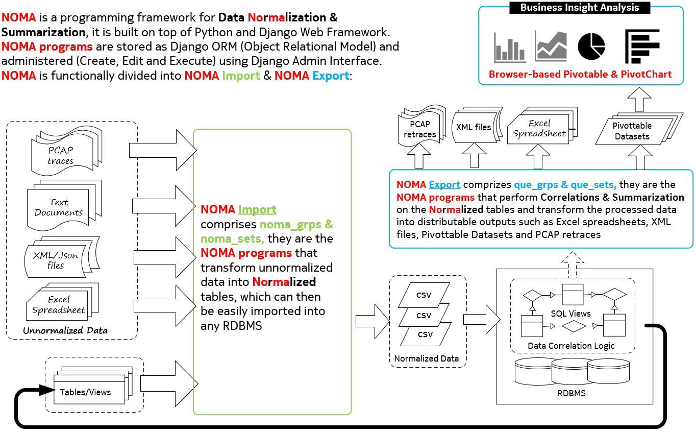

# NOMA

## Getting Started

These instructions will get you a copy of the project up and running on your local machine for development and testing purposes. See deployment for notes on how to deploy the project on a live system.

### Prerequisites

	1. Install Notepad++
	2. Install Mariadb & HeidiSQL
	3. Create Database nomadb & xnaxdr (for multi-tenent create nomadb1 & xnaxdr1)
	4. Install Python 3.6.3
	5. Upgrade pip (py -m pip install --upgrade pip)
	6. install redis (Redis-x64-3.2.100.msi) for Windows (run as service)
	   https://github.com/MicrosoftArchive/redis/releases
	7. Install Git (git-scm.com)

### Installing

	8. Git clone github.com/ckhu2020/xna2
	9. Install virtualenv (py -m pip install --user virtualenv)
	10. Create virtual environment named sera_venv in folder pyenvs/sera/
	11. Activate virtual environment sera_venv (pyvenvs/sera/sera_venv/Scripts/activate)
	12. cd to /sera/xna2, run pip install -r noma_dependencies.xtx
	13. Download dash_pivottable from https://github.com/xhlulu/dash_pivottable. Copy dash_pivottable folder to pyvenvs/sera/sera_venv/Lib/site-packages
	14. Create data folder (sera/data/nomasftp/uploads & downloads)
	15. Update settings.ini (using settings.ini.example as template)
	16. Create a migrations folder under xna2/noma and create an empty  __init__.py inside
	17. Launch Powershell, activate sera_venv, Run python manage.py makemigrations,  python manage.py migrate
	18. Run HeidiSQL to check NOMA ORM tables are created
	19. Under sera_venv, Run python manage.py createsuperuser
	20. Under sera_venv, Run python manage.py collectstatic 
	    (this will collect all noma static files under settings.STATIC_ROOT
	21. Under sera_venv, Run python manage.py runserver
	22. Launch anonther Powershell, activate sera_venv, Run celery -A xna2 worker -l info
	23. Open Chrome browser: 127.0.0.1:8000/noma, login using superuser created in step-19
	24. In developer mode (i.e. runserver and DEBUG=True), copy settings.STATIC_ROOT/dash to xna2/noma/static/dash
	25. Run NOMA Query Group Dash_Pivot_Datasets, if Dash Pivottable is not loading, use Chrome developer tool (ctrl+shift+i) to check the console errors and 
	    correct the dash static files versioning in xna2.noma/static/dash according to the console errors mesages

## NOMA API ORM Specification

## Deployment

NOMA can be deployed on Nginx and Gunicorn running on CentOS. Please contact the author for consulting & system integration serivces.

## Authors

* **Hu Chee Kiong** - *Initial work* - [CHEEHU](https://github.com/CHEEHU)

## License

This project is licensed under the MIT License - see the [LICENSE.md](LICENSE.md) file for details

## Acknowledgments

NOMA is standing on the shoulders of giants, all the heavylifiting are done by the giants listed (but not limited to) below:

* Python ecosystem (for the full list of depenencies, see noma_dependencies.txt)
* MariaDB & HeidiSQL
* Django Web Framework
* Plotly-Dash and react-pivottable
* Nginx & Gunicorn
* CentOS
* Notepad++
* Celery + Redis
* git-scm.com

NOMA relies heavily on codes contributed by others, here is the partial list:

1. react-pivottable:
https://github.com/plotly/react-pivottable
https://github.com/xhlulu/dash_pivottable
https://github.com/GibbsConsulting/django-plotly-dash

2. celery & redis ssynchronous task execution:
https://rakibul.net/django-celery-1
https://medium.com/@markgituma/using-django-2-with-celery-and-redis-21343284827c
https://computingforgeeks.com/configure-celery-supervisord-centos-7-django-virtualenv/

3. django-inline-admin-extensions
Django admin interface page with tabularinline will become slow to load when the list of tabular items become too long (> 30 items). 
The solution is to add pagination (with 20 items per page) to the tabularinline. After googling around, I found a working solution from:
https://github.com/ctxis/django-inline-admin-extensions
